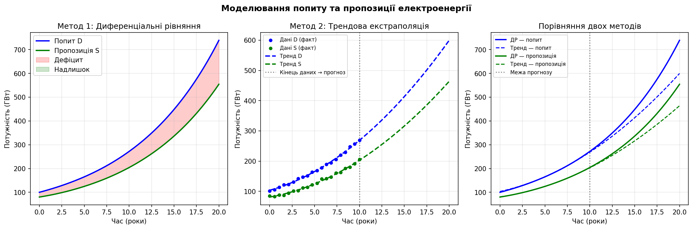

# Практична робота №4 (варіант 19)
## Моделювання системи попиту та пропозиції електроенергії

| | |
|---|---|
| **Студент** | Слюнько Ігор, група ТВ-32 |
| **Дисципліна** | Технології збору та обробки даних |
| **Рік** | 2026 |

---

## Мета

Реалізувати динамічну модель попиту та пропозиції електроенергії двома методами і порівняти їх точність на горизонті прогнозування.

---

## Методи

### 1. Диференціальні рівняння (ДР)

Система з двох рівнянь:

```
dD/dt = a · D        # попит зростає пропорційно собі
dS/dt = b · (D - S)  # пропозиція наздоганяє попит
```

- `D` — попит (ГВт), `S` — пропозиція (ГВт)
- `a = 0.1` — темп зростання попиту
- `b = 0.3` — швидкість реакції виробників
- Розв'язувач: **RK45** (`scipy.integrate.odeint`)

### 2. Трендова екстраполяція

- Беремо дані за перші **10 років** (з реалістичним шумом)
- Апроксимуємо **поліномом 2-го степеня** (`numpy.polyfit`)
- Продовжуємо криву на наступні 10 років

---

## Результати

| Показник | ДР | Тренд |
|---|---|---|
| Попит на старті | 100 ГВт | 100 ГВт |
| Попит через 20 років | 739 ГВт | 241 ГВт |
| Пропозиція через 20 років | 554 ГВт | 101 ГВт |
| Дисбаланс D−S | 185 ГВт | 140 ГВт |



---

## Висновки

- **До межі прогнозу (10 р.)** — методи дають схожі результати.
- **Після 10 років** — розбіжність суттєво зростає:
  - ДР враховує зворотній зв'язок між попитом і пропозицією
  - Тренд просто продовжує параболу, ігноруючи ринкову динаміку
- Метод ДР точніший для **довгострокового прогнозування**, трендова екстраполяція — простіша і підходить для **короткострокових** оцінок.