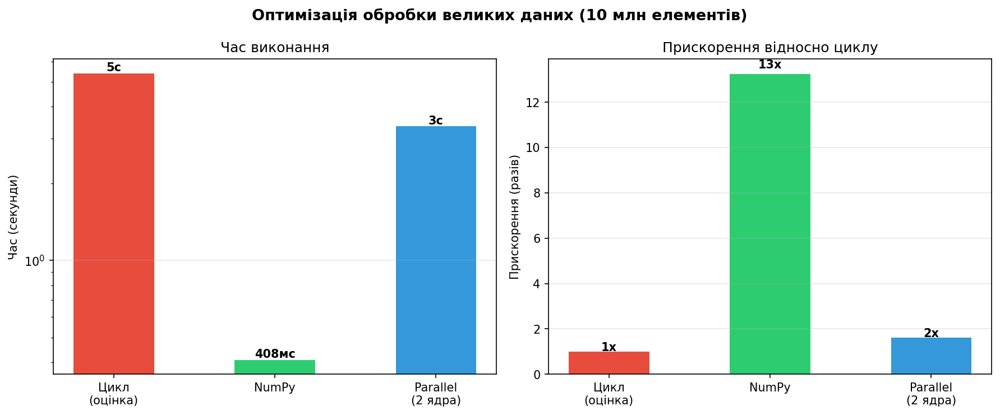

# Практична робота №5 (варіант 19)
## Оптимізація коду для обробки великих наборів даних

| | |
|---|---|
| **Студент** | Слюнько Ігор, група ТВ-32 |
| **Дисципліна** | Технології збору та обробки даних |
| **Рік** | 2026 |

---

## Мета

Порівняти три підходи до обробки великих масивів даних і визначити найефективніший.

---

## Методи

### 1. Звичайний цикл
```python
for x in arr:
    result.append(sqrt(x**2 + 2*x + 1) / (x + 1))
```
Найпростіший спосіб. Кожен елемент обробляється окремо в Python — повільно.

### 2. NumPy (векторизація)
```python
np.sqrt(arr**2 + 2*arr + 1) / (arr + 1)
```
Операція виконується одразу над усім масивом. Під капотом — оптимізований C-код.

### 3. Multiprocessing (паралельні обчислення)
```python
chunks = np.array_split(arr, n_workers)
pool.map(process_chunk, chunks)
```
Масив ділиться на частини, кожна обробляється в окремому процесі на своєму ядрі CPU.

---

## Результати (10 млн елементів)

| Метод | Час | Прискорення |
|---|---|---|
| Цикл | ~5.4 с | 1x (базовий) |
| NumPy | 0.41 с | **13x** |
| Parallel (2 ядра) | 3.35 с | 2x |



> **Примітка:** Parallel програє NumPy на цій задачі, бо накладні витрати на запуск процесів (~1-2 с) перевищують виграш від паралелізму. На складніших операціях — навпаки.

---

## Висновки

- **NumPy** — найкращий вибір для математичних операцій над масивами. Мінімум коду, максимум швидкості.
- **Multiprocessing** виграє, коли операція складна і не може бути векторизована (наприклад, парсинг тексту, складні бізнес-правила).
- Звичайний цикл підходить тільки для малих даних або коли код потрібно написати швидко і читабельно.