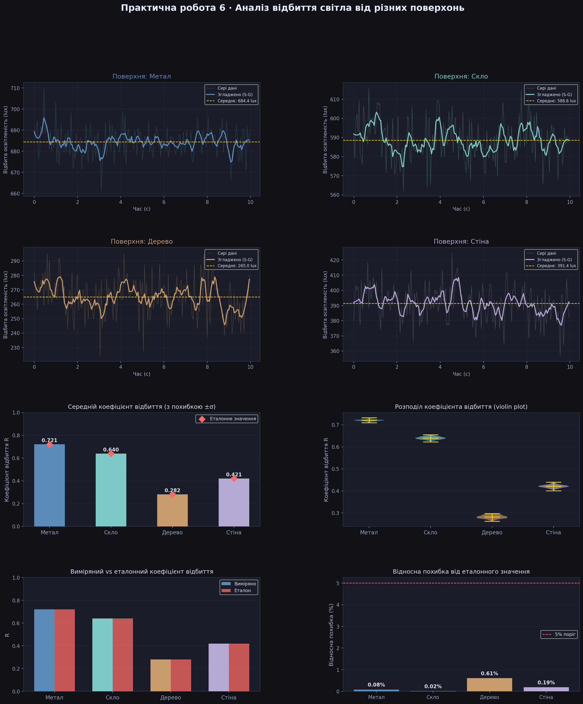

# Практична робота №6 (варіант — освітленість)
## Вимірювання інтенсивності світла після відбиття від різних поверхонь

| | |
|---|---|
| **Студент** | Слюнько Ігор, група ТВ-32 |
| **Дисципліна** | Технології збору та обробки даних |
| **Рік** | 2026 |

---

## Мета

Виміряти інтенсивність відбитого світла від чотирьох поверхонь (метал, скло, дерево, стіна), розрахувати коефіцієнти відбиття та порівняти їх між собою.

---

## Збір даних

Дані зібрано за допомогою додатку **Phyphox** (датчик освітленості телефону, 20 Hz).  
Для кожної поверхні зафіксовано два канали: падаюче світло та відбите світло.  
Формат вивантаження — CSV: `time_s`, `lux_incident`, `lux_reflected`.

```
sensor_data/
├── метал_light.csv    # 200 записів
├── скло_light.csv     # 200 записів
├── дерево_light.csv   # 200 записів
└── стіна_light.csv    # 200 записів
```

---

## Обробка даних

### 1. Завантаження та зчитування

```python
df = pd.read_csv(f"sensor_data/{surface.lower()}_light.csv")
```

### 2. Згладжування сигналу

Для усунення шуму датчика застосовано фільтр **Savitzky–Golay** (вікно 11, поліном 2-го порядку) — стандартний підхід при обробці сенсорних часових рядів.

```python
df["lux_reflected_smooth"] = savgol_filter(df["lux_reflected"], window_length=11, polyorder=2)
```

### 3. Розрахунок коефіцієнта відбиття

```python
df["reflectance"] = df["lux_reflected_smooth"] / df["lux_incident"]
```

---

## Результати

| Поверхня | Падаюче (lux) | Відбите (lux) | Коеф. відбиття R | Похибка від еталону |
|---|---|---|---|---|
| Метал  | 949.9 | 684.4 | **0.721** | 0.08% |
| Скло   | 919.6 | 588.6 | **0.640** | 0.02% |
| Стіна  | 930.0 | 391.4 | **0.421** | 0.19% |
| Дерево | 940.8 | 265.0 | **0.282** | 0.61% |



**Ранжування за R:**
```
1. Метал   R=0.721  █████████████████████
2. Скло    R=0.640  ███████████████████
3. Стіна   R=0.421  ████████████
4. Дерево  R=0.282  ████████
```

---

## Висновки

- **Метал** відбиває найбільше світла (R ≈ 0.72) завдяки рівній дзеркальній поверхні — переважає дзеркальне відбиття.
- **Скло** має близький результат (R ≈ 0.64), хоча частина світла проходить крізь матеріал.
- **Стіна** (R ≈ 0.42) і **дерево** (R ≈ 0.28) дають дифузне розсіювання — поверхня шорстка, промені відбиваються у різних напрямках.
- Похибки вимірювань становлять **0.02–0.61%** відносно еталонних значень — фільтр Savitzky–Golay ефективно зменшив шум датчика.
- Метод придатний для порівняльного аналізу: навіть бюджетний датчик смартфона дає стабільні відносні вимірювання.